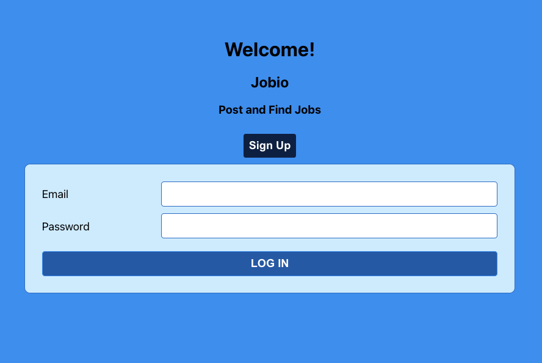
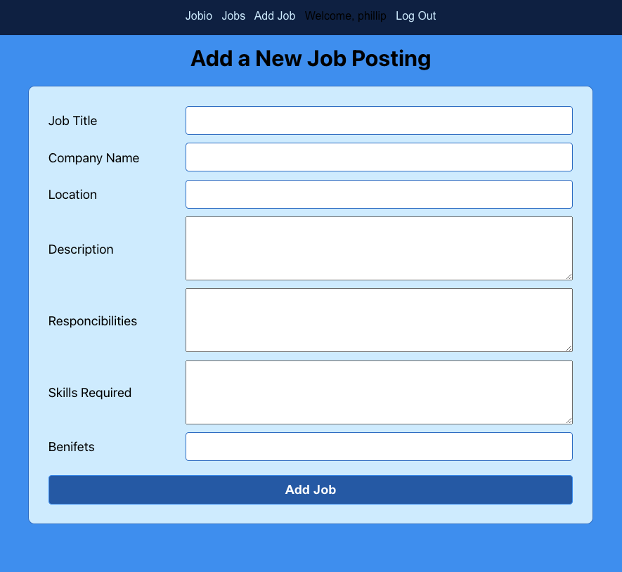
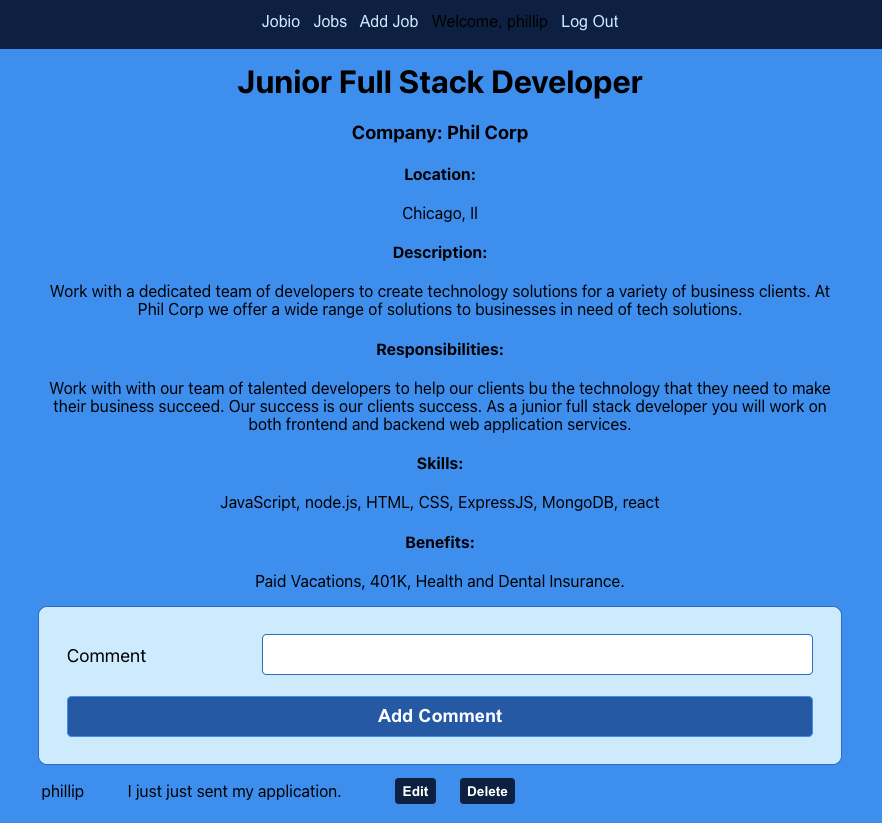

## Recipe Share
Jobio is a job posting website that allows companies to post jobs for potential applicants to view and potentially decide to apply.    

[Jobio](https://jobio.herokuapp.com/)  

[Project Planning](https://trello.com/b/G9pClnXN/job-board)

I designed the site with a simple and elegant color scheme that is continuous throughout.

## Functionality

When the user arrives on the page, they are greeted with a page that prompts them to either sign up or login. If the user does not have an account they will need to create one using the sign up for. If the user has an account can simply login using the login form.   

The new job page provides the usr with a form to with the nessacary feilds to create a thourogh job post.   

The Job detail page displays the jobs create using the new hob page.   

## Technologies Used

HTML, CSS, React, Javascript, nade.js, Express, Mongoose, MongoDB

## Future Additions
[ ] Image panel on home page, providing links to 3 most recent job posts.  

[ ] User page, with job postings made by the lgged in user.   

[ ] Allow job posters to add a company logo to the job posting.

[ ] Add a resume builder to make it easier for job seakers to apply to jobs. 

